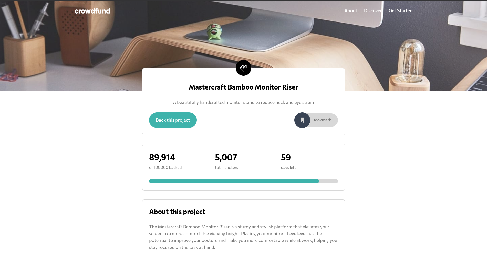

# Frontend Mentor - Crowdfunding page solution

This project is a responsive React + TypeScript implementation of the Frontend Mentor crowdfunding product page challenge. The UI presents the Mastercraft Bamboo Monitor Riser project with its funding progress, available rewards, contribution flow, and responsive navigation.

## Table of contents

- [Overview](#overview)
  - [The challenge](#the-challenge)
  - [Features](#features)
- [My process](#my-process)
  - [Built with](#built-with)
  - [What I learned](#what-i-learned)
  - [Continued development](#continued-development)
  - [Useful resources](#useful-resources)
  - [AI collaboration](#ai-collaboration)
- [Getting started](#getting-started)
- [Project structure](#project-structure)
- [Author](#author)

## Overview



### The challenge

Users should be able to:

- View the interface in an optimized layout for both mobile and desktop screens
- Explore the project description, funding statistics, and available rewards
- Open a modal to select a reward and pledge an amount
- See the progress bar update after supporting the project
- Bookmark the project and use the responsive navigation menu
- Receive a confirmation message after completing a pledge

### Features

- Responsive design adapted for small and large screens
- Accessible dialogs for navigation, pledges, and successful contributions
- Dynamic crowdfunding statistics and reward availability managed with React context
- Interactive reward selection with custom pledge amounts
- Bookmark toggle with visual feedback
- Progress bar reflecting the current funding amount

## My process

### Built with

- [React](https://react.dev/)
- [TypeScript](https://www.typescriptlang.org/)
- [Vite](https://vite.dev/)
- [Tailwind CSS](https://tailwindcss.com/)
- [Radix UI Dialog](https://www.radix-ui.com/primitives/docs/components/dialog)
- [ESLint](https://eslint.org/) and [Prettier](https://prettier.io/)

### What I learned

This challenge helped me strengthen my skills in:

- Building responsive interfaces with a mobile-first approach
- Structuring reusable UI components in React
- Managing shared crowdfunding state with React context
- Creating accessible modal flows with Radix UI Dialog
- Handling conditional UI states such as unavailable rewards and completed campaigns

### Continued development

I would like to keep improving this project by:

- Persisting pledge and bookmark state between sessions
- Refining the motion and transition details
- Expanding accessibility and keyboard interaction support

### Useful resources

- [Frontend Mentor challenge](https://www.frontendmentor.io/challenges/crowdfunding-product-page-qiSk7mpH)
- [React documentation](https://react.dev/learn)
- [TypeScript documentation](https://www.typescriptlang.org/docs/)
- [Tailwind CSS documentation](https://tailwindcss.com/docs)
- [Radix UI Dialog documentation](https://www.radix-ui.com/primitives/docs/components/dialog)

### AI collaboration

AI tools were used as a support during the development process for reviewing implementation ideas, improving documentation, and exploring accessibility considerations.

## Getting started

Install dependencies:

```bash
npm install
```

Run the development server:

```bash
npm run dev
```

Run the linter:

```bash
npm run lint
```

Build for production:

```bash
npm run build
```

Preview the production build:

```bash
npm run preview
```

## Project structure

```text
src/
  assets/
    bg/
    svg/
  components/
    ui/
    BackProjectModal.tsx
    Header.tsx
    ProjectAbout.tsx
    ProjectHero.tsx
    ProjectStats.tsx
    RewardCard.tsx
  constants/
  context/
  hooks/
  types/
  utils/
```

## Author

- Website - [Crowdfunding product page](https://molinax18.github.io/fm-crowdfunding-page/)
- Frontend Mentor - [@molinax18](https://www.frontendmentor.io/profile/molinax18)

Ariel Molina
